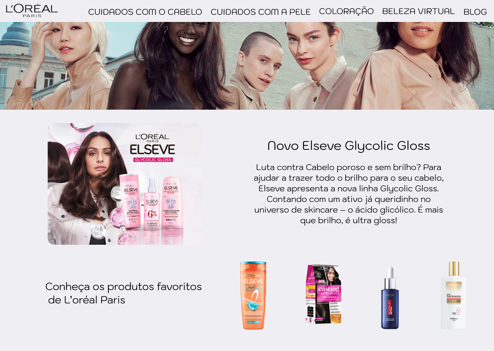

# Clone Homepage L'Oréal 🦋
Este projeto é um clone da homepage da L'Oréal, desenvolvido usando **HTML** e **SASS**. Foi criado como parte de um desafio de desenvolvimento frontend para o primeiro módulo do curso de **desenvolvimento FrontEnd** do @VainaWeb.

## Demonstração
Nas versões desktop e mobile:

